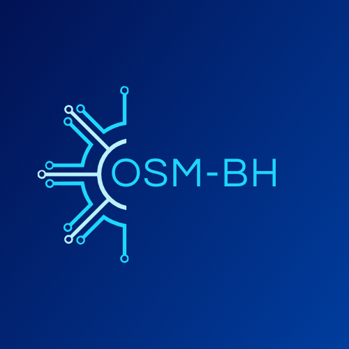

# 
PROJETO SITE OSMBh

 

## OBJETIVO:

Este repositório tem como objetivo demonstrar o desenvolvimento de um WebSite multipáginas responsivo da empresa OSM-BH.

Neste projeto será aplicado a programação Front-End, utilizando o css flexbox para alinhar os elementos, tecnica parallax.

---

## Estrutura dos projetos:

    Website multipáginas

---

## Tecnologia:

---

### Créditos:

<a target="_blank" href="https://icons8.com/icon/13118/services">Services</a> ícone por <a target="_blank" href="https://icons8.com">Icons8</a>

https://bennettfeely.com/clippy/

---

## Autora:

[ **Nilva Pires**](https://github.com/nilva2020)  

 

<left> </left>

 

---

Developing since | 2020

